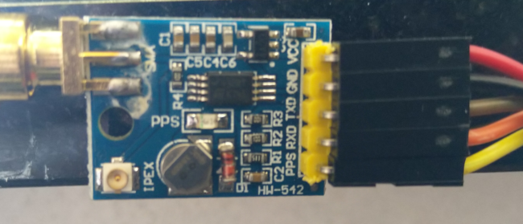

# pi-time
Raspberry PI Stratum 1 server

# Raspberry Pi Installation script

### Bash script automating the installation of a GPS / PPS Disciplined Stratum-1 Server on the Raspberry Pi 3 or 4 

### Design principles:
  - Dedicated to being a Stratum-1 NTP server
  - Use a GPS Breakout board

### Known issues:
  - None so far
  - Should work on a Pi Zero, but as these have no ethernet cable, and NTP over wireless is less than optimal it's untested
  - May work on a Raspberry Pi 2, haven't tried.

### Latest changes 
#### 2021-12-02 - Raspberry Pi OS (64-bit) Lite
  - Tested to work with Raspberry Pi OS (64-bit) Lite

#### 2021-12-02 - Bullseye version
  - Version 4.00 now for Debian 11 (Bullseye)
  
#### 2021-12-05 - 1GHz
  - Pinned clock frequency at 1GHz - seems to give best precision, anything below that is -19 instead of -20 at 1GHz

#### 2021-12-10 - config.txt include ntpserver.txt
  - Keeping the original config.txt, only adding include ntpserver.txt

### Installation
Prerequisite: A Raspberry PI 3 or 4
 - Download the latest Raspberry Pi OS Lite here: https://downloads.raspberrypi.org/raspios_lite_armhf/images/raspios_lite_armhf-2021-11-08/2021-10-30-raspios-bullseye-armhf-lite.zip
 - Write the latest Raspberry Pi OS Lite, which is based on Debian 11 (Bullseye), to a good quality sd-card using dd or whatever tool you prefer
 - Run prep_sd.sh, enter a new hostname for the pi1.
 - Boot the Pi, logon as pi/raspberrypi (user pi will be disabled later)
 - sudo su -
 - run ./install-rpi-stratum1.sh
 - Watch install progress on the tty, and from another SSH session, run *tail -fn1000 /var/log/syslog | grep 'Stratum1 NTP Server'*
 - After reboot the Pi should now provide good time, however give it time :) lots of time to achieve good precision

1 prep_sd.sh prepares the SD-Card enabling SSH, copies the install script, and changes hostname on the sd-card

### Hardware
It's easy to find GPS breakout boards for Arduino or Raspberry Pi's on ebay, amazon, and other semi-dubious marketplaces.
However there's also great boards from Adafruit and others.
 - Make sure the board outputs the PPS signal.
 - The serial I/O and PPS _must_ be 3.3v TTL level serial. If it's 5 volt serial, then level shifting is needed, however 
 - some boards can be supplied with 5v and still only outputs 3v3.
 - 5v output will ***kill*** the GPIO on the Raspberry Pi. Start with powering the GPS Board with 3v3 and see if that works.
 - Connect the ground of the GPS module to pin 6 (Ground) of the GPIO header on the Raspberry Pi.
 - Connect either a +5 power input to pin 2 (or pin 4) of the GPIO header (see above for 5v warning), or
 - +3v3 power input to pin 1 (or pin 17) of the GPIO header.
 - Connect the serial input (RXD) of the GPS module to pin 8 of the GPIO header. This is the UART TXD on the Raspberry Pi2.
 - Connect the serial output (TXD) to pin 10 of the GPIO header. This is the UART RXD on the Raspberry Pi2.
 - Connect the PPS signal to pin 12 (GPIO 18) of the GPIO header.

2 When configured with enable_uart=1 in /boot/config.txt. The install-script does this in *configure_pps*.

### GPIO Pinout from raspberrypi.org

Below is a picture of GPS board I've used several of for exactly this purpose (lucky to buy 7 for a great price).

 

## Tips and tricks for troubleshooting
Check syslog for 'finalized installation of stratum-1 server', then at least the script finished, but there should also be a log entry for each routine called (main)
### Follow the log during installation
- tail -fn1000 /var/log/syslog | grep 'Stratum1 NTP Server'
### Verify pps
- dmesg | grep pps
- ppstest /dev/pps0
- ppswatch -a /dev/pps0
### Run gpsd manually (stop gpsd.socket first)
- gpsd -D 5 -N -n /dev/ttyAMA0 /dev/pps0 -F /var/run/gpsd.sock
- systemctl stop gpsd.*
- killall -9 gpsd
Reconfigure gpsd
- dpkg-reconfigure -plow gpsd
### Check GPS reception and ensure that it outputs to NTP
- cgps -s
- gpsmon
- ipcs -m
- ntpshmmon
### Monitoring the ntp daemon
- ntpq -crv -pn
- watch -n 10 'ntpstat; ntpq -p -crv; ntptime;'
- watch -n 10 'hostname -s; echo -----------; ntpstat; ntpq -p -crv; ntptime;'
### or if using Chrony
- watch -n5 'hostname -s; echo --------; chronyc sources -v; chronyc tracking;'
### If HW clock installed
- dmesg | grep rtc
- hwclock --systohc --utc
- hwclock --show --utc --debug
- cat /sys/class/rtc/rtc0/date
- cat /sys/class/rtc/rtc0/time
- cat /sys/class/rtc/rtc0/since_epoch
- cat /sys/class/rtc/rtc0/name
- i2cdetect -y 1
### Update system
- export DEBIAN_FRONTEND=noninteractive; apt update; apt full-upgrade -y;
